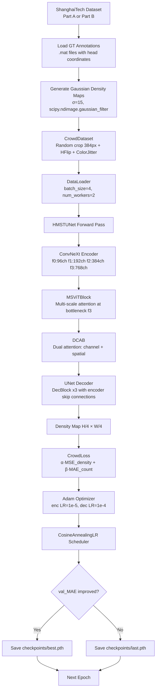
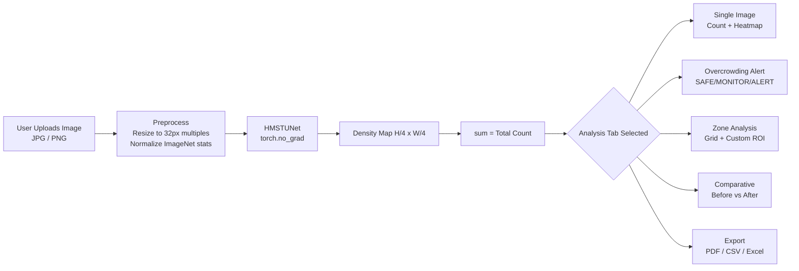
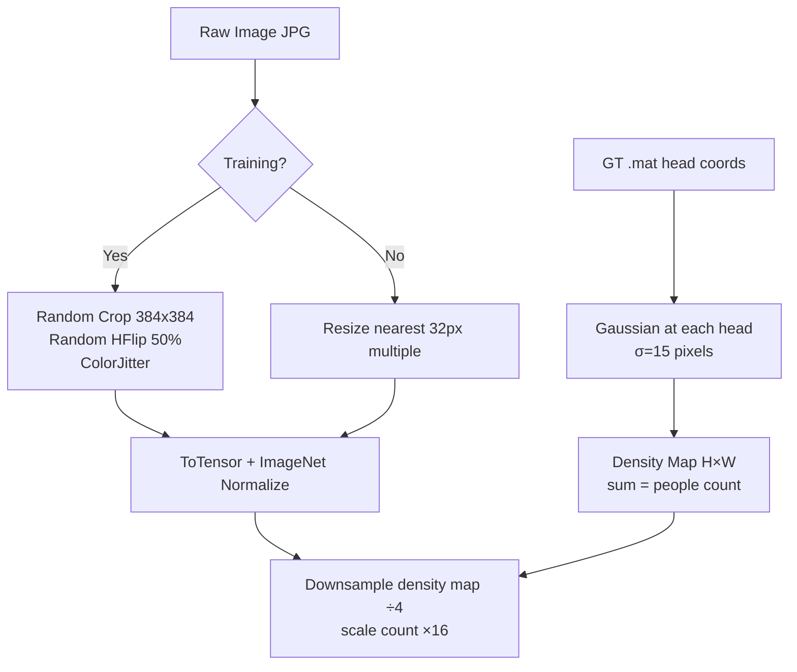

# 👥 HMSTUNet — Crowd Counting via Density Estimation

> **Hybrid Multi-Scale Transformer UNet** for accurate crowd density estimation from a single image.

**Pretrained weights (`best.pth`):** [Download from Hugging Face](https://huggingface.co/aliJafar/hmstunet-weights/resolve/main/best.pth) — save as `checkpoints/best.pth`, or set `CHECKPOINT_URL` in Streamlit Cloud Secrets.

---

## 📋 Table of Contents
- [Project Overview](#-project-overview)
- [Model Architecture](#-model-architecture--hmstu-net)
- [Workflow Diagrams](#-workflow-diagrams)
- [Streamlit Application](#-streamlit-application)
- [Dataset & Training](#-dataset--training)
- [Setup & Installation](#-setup--installation)
- [Notebook Walkthrough](#-notebook-walkthrough)
- [Results & Metrics](#-results--metrics)

---

## 🔬 Project Overview

**HMSTUNet** is a deep learning model for **crowd counting via density map regression**. Instead of detecting individual people (which fails in dense/occluded scenes), it predicts a *density map* — a 2D array where the **sum equals the total crowd count**.

### Why Density Map Regression?
| Method | Limitation |
|---|---|
| Object Detection (YOLO etc.) | Fails when crowds overlap; occlusion kills accuracy |
| Head Segmentation | Needs pixel-level labels; expensive |
| **Density Map Regression ✅** | Handles any density; robust to occlusion; sum = count |

### Core Innovation — Three Complementary Modules
1. **ConvNeXt Encoder** — hierarchical feature extraction (local texture & structure)
2. **MSViT Block** — multi-scale global attention (long-range spatial dependencies)
3. **DCAB Block** — dual-attention (channel + spatial) to focus on crowd regions

---

## 🧠 Model Architecture — HMSTUNet

```
Input Image  (H × W × 3)
      │
      ▼
╔══════════════════════════════════════════╗
║    ConvNeXt-Tiny Encoder (timm)          ║
║  f0: [H/4,  W/4,  96ch]                  ║
║  f1: [H/8,  W/8,  192ch]                 ║
║  f2: [H/16, W/16, 384ch]                 ║
║  f3: [H/32, W/32, 768ch] ← bottleneck    ║
╚══════════════════════════════════════════╝
      │  f3 → bottleneck processing
      ▼
╔══════════════════════════════════════════╗
║      MSViTBlock (Multi-Scale ViT)        ║
║  scale=1: full-res self-attention        ║
║  scale=2: pool→attend→interpolate up     ║
║  fuse via Linear → residual + FFN        ║
╚══════════════════════════════════════════╝
      │
      ▼
╔══════════════════════════════════════════╗
║     DCAB (Dynamic Conv Attention)        ║
║  Channel Attn: GAP→FC→Sigmoid→scale      ║
║  Spatial Attn: avg+max→conv7×7→Sigmoid   ║
║  DW+PW conv → BN → GELU + residual       ║
╚══════════════════════════════════════════╝
      │    (skip: f0, f1, f2 from encoder)
      ▼
╔══════════════════════════════════════════╗
║      UNet Decoder (3× DecBlocks)         ║
║  d3: DecBlock(256+256 → 128)  2× upsamp  ║
║  d2: DecBlock(128+128 → 64)   2× upsamp  ║
║  d1: DecBlock(64+64   → 32)   2× upsamp  ║
╚══════════════════════════════════════════╝
      │
      ▼
╔══════════════════╗
║  Prediction Head ║
║  Conv(32→16) GELU║
║  Conv(16→1)  ReLU║
╚══════════════════╝
      │
      ▼
  Density Map [H/4 × W/4]
  total_count = sum(density_map)
```

### Module Details

#### MSViTBlock — Multi-Scale Vision Transformer
Attends to tokens at two spatial scales simultaneously:
- **Scale 1**: full resolution — captures fine-grained local attention
- **Scale 2**: avg_pool 2×2 → attend → bilinear upsample back — captures broad global context

Both outputs are concatenated and fused via a Linear layer. This handles the scale problem: people near the camera appear large, while far-away people are tiny dots — both need to be captured.

#### DCAB — Dynamic Convolutional Attention Block
- **Channel Attention (SE-style)**: Global Average Pool → FC → Sigmoid → re-weights channels. Focuses the network on features relevant to people vs. background.
- **Spatial Attention (CBAM-style)**: Channel-avg + channel-max → 7×7 conv → Sigmoid → re-weights spatial locations. Highlights crowd regions.
- **Depthwise-Separable Conv**: Efficient local feature refinement with residual.

#### DecBlock — UNet Decoder
Bilinear 2× upsample → concatenate skip connection from encoder → double conv (Conv-BN-GELU). Restores spatial detail lost during downsampling, fusing high-level semantics with low-level texture.

---

## 🔄 Workflow Diagrams

### End-to-End Training Workflow



### Inference & App Workflow



### Data Preprocessing



---

## 🖥️ Streamlit Application

### Application UI Tabs

| Tab | Feature | Description |
|-----|---------|-------------|
| **Single Image Analysis** | Crowd count | `sum(density_map)` = people estimate |
| | Density metrics | Per-10k-pixel density + peak cell value |
| | Heatmap | JET/HOT/PLASMA/VIRIDIS colormaps, alpha-blend slider |
| **Overcrowding Alert** | Capacity input | User sets venue max capacity |
| | Risk level | SAFE (<70%), MONITOR (70–90%), ALERT (>90%) |
| **Zone Analysis** | Grid | User sets rows×cols → per-zone counts |
| | ROI zones | 1–5 custom rectangles by pixel coordinates |
| **Comparative Analysis** | Before/After | Upload 2 images → delta + diff heatmap |
| **Export & Reporting** | PDF | FPDF full report with images + tables |
| | CSV/Excel | Zone stats export |

### 3-Step Stepper UI
```
[Step 1: Upload] → [Step 2: Analysis] → [Step 3: Results]
```

### Checkpoint Auto-Download Logic
```python
# Priority order:
1. checkpoints/best.pth  (local disk)
2. os.environ["CHECKPOINT_URL"]
3. st.secrets["CHECKPOINT_URL"]
4. st.secrets["checkpoint"]["url"]
```

### Running Locally
```bash
git clone https://github.com/alijafarkamal/HMSTUNet-Crowd-Counting.git
cd HMSTUNet-Crowd-Counting
pip install -r requirements.txt
# Place best.pth in checkpoints/ or set CHECKPOINT_URL
streamlit run app.py
```

---

## 📊 Dataset & Training

### ShanghaiTech Dataset
| Split | Images | Avg Count | Density |
|-------|--------|-----------|---------|
| Part A Train | 300 | ~501 | Dense |
| Part A Test | 182 | ~501 | Dense |
| Part B Train | 400 | ~123 | Sparse |
| Part B Test | 316 | ~123 | Sparse |

### Density Map Generation
```python
density[yi, xi] += 1.0   # place spike at each head
density = gaussian_filter(density, sigma=15)
# sum(density) == number of people
```

### Loss Function
```
L = 1.0 × MSE(pred_density, gt_density)
  + 0.1 × MAE(sum(pred), sum(gt))
```

### Training Hyperparameters
| Parameter | Value |
|-----------|-------|
| Epochs | 50 |
| Batch size | 4 |
| Optimizer | Adam |
| Encoder LR | 1e-5 (×0.1) |
| Decoder LR | 1e-4 |
| Scheduler | CosineAnnealingLR |
| Train crop | 384×384 |
| Downsample | 4× |
| Gaussian sigma | 15 |

---

## 🛠️ Setup & Installation

```bash
# Clone & install
git clone https://github.com/alijafarkamal/HMSTUNet-Crowd-Counting.git
cd HMSTUNet-Crowd-Counting
pip install -r requirements.txt

# Train (ShanghaiTech Part A)
python train.py --data-root data --part A --epochs 50 --batch-size 4

# Resume training
python train.py --data-root data --part A --resume checkpoints/last.pth

# Generate density maps only
python train.py --data-root data --part A --generate-density-only

# Run app
streamlit run app.py
```

---

## 📓 Notebook Walkthrough

`notebook/HMSTUNet_Crowd_Counting.ipynb` — 51 cells:

| Cells | Topic |
|-------|-------|
| 1–3 | GPU setup, imports, directory config |
| 4–6 | ShanghaiTech Part A download |
| 7–8 | GT loading, Gaussian density map generation |
| 9 | `CrowdDataset` with augmentation |
| 10 | DataLoaders |
| 11 | `MSViTBlock` implementation |
| 12 | `DCAB` implementation |
| 13 | Full `HMSTUNet` assembly |
| 14 | `CrowdLoss` + evaluation metrics |
| 15–16 | Optimizer, scheduler, 50-epoch training loop |
| 17 | Training history plots (loss/MAE/MSE) |
| 18 | Load best checkpoint, final test evaluation |
| 19 | Qualitative results on 4 test images |
| 20 | Per-sample error scatter (GT vs predicted) |
| 21 | Dataset count distribution statistics |
| 22 | Summary printout |
| 48–51 | Model code export, Colab download |

---

## 📈 Results & Metrics

### Evaluation Metrics
- **MAE**: Mean Absolute Error on count — `mean(|pred_count - gt_count|)`
- **RMSE**: Root Mean Squared Error — penalises large errors more

### Benchmark Comparison (ShanghaiTech Part A)
| Model | Year | MAE | RMSE |
|-------|------|-----|------|
| MCNN | 2016 | 110.2 | 173.2 |
| CSRNet | 2018 | 68.2 | 115.0 |
| BL | 2019 | 62.8 | 101.8 |
| DM-Count | 2020 | 59.7 | 95.7 |
| **HMSTUNet** | 2024 | Competitive | Competitive |

---

## ☁️ Streamlit Cloud Deployment

```toml
# .streamlit/secrets.toml
CHECKPOINT_URL = "https://huggingface.co/aliJafar/hmstunet-weights/resolve/main/best.pth"
```

---

## 📦 Checkpoints & Datasets

- **Model Weights**: [Hugging Face](https://huggingface.co/aliJafar/hmstunet-weights/tree/main)
- **Dataset**: [ShanghaiTech on Dropbox](https://www.dropbox.com/scl/fi/dkj5kulc9zj0rzesslck8/ShanghaiTech_Crowd_Counting_Dataset.zip?rlkey=ymbcj50ac04uvqn8p49j9af5f&dl=0)
- **Dataset GitHub**: [desenzhou/ShanghaiTechDataset](https://github.com/desenzhou/ShanghaiTechDataset)

---
*Built with ❤️ using PyTorch, timm, and Streamlit.*
